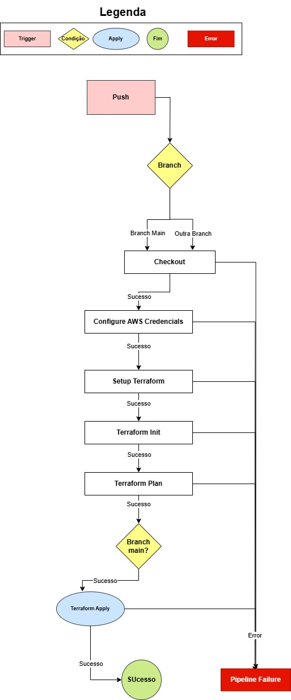

# Desafio de Infraestrutura

Realizar o deploy de uma infraestrutura utilizando Terraform e Github Actions

## tecnologias Utilizadas

- Terraform
- GitHub Actions
- Ansible
- AWS

## Estrutura do Projeto

```bash
.
├── .github/
│   └── workflows
│       └── terraform.yml # Manifesto do GitHub Actions
├── ansible/
│   ├── hosts
│   └── nginx_playbook.yaml
├── terraform/
│   ├── env/
│   │   └── hml/ # Pasta de configuração de um ambiente HMl, podendo subdividir os projetos em vários ambientes
│   │       ├── backend.tfvars # Arquivo de configuração para o state ser salvo em um bucket s3
│   │       └── terraform.tfvars # Variáveis de ambiente de HML
│   ├── backend.tf
│   ├── cloudwatch.tf
│   ├── ec2.tf
│   ├── internet_gateway.tf
│   ├── key_pair.tf
│   ├── nat_gateway.tf
│   ├── output.tf
│   ├── parameters_store.tf
│   ├── private_subnets.tf
│   ├── public_subnets.td
│   ├── security_group.tf
│   ├── variables.tf
│   └── vpc.tf.tf
│
├── .gitignore
│   
└── README.md
```

## Monitoramento

- Foi escrito um trecho de código dentro do terraform no arquivo cloudwatch.tf um parametro de monitoramento de CPU da instância ec2, podendo abrangir com mais métricas e utilizando o serviço nativo da AWS para o monitoramento com uma trigger.

## Execução local

- Realizar o clone do repositório
- Logo em seguida realizar os comandos abaixo (Lembrando que as configurações devem seguir o seu ambiente, nesse repo tem chaves de acesso, mas são descartáveis.)

## Aplicar o terraform init apontando o backend para um bucket s3
```bash
terraform init -backend-config=env/hml/backend.tfvars
```
## Aplicar o terraform plan apontando para o ambiente de hml
```bash
terraform plan -var-file=env/hml/terraform.tfvars
```

## Aplicar o terraform apply apontando para o ambiente de hml
```bash
terraform apply --auto-approve -var-file=env/hml/terraform.tfvars
```

## Aplicar o terraform destroy apontando para o ambiente de hml
```bash
terraform destroy --auto-approve -var-file=env/hml/terraform.tfvars
```

## Executar o playbook ansible

- Para executar o playbook é necessário pegar o endereço IP que está no output de nome "aws_eip_ec2"
```bash
ansible-playbook -i hosts -u ubuntu --private-key=~/.ssh/teamsoft_ssh.pem nginx_playbook.yaml
```

## Pipeline

- A pipeline está configurada com uma trigger de execução quando realizar um push para a branch main, quando o mesmo é realizado a pipeline é executada, conforme está no caminho ".github/workflows/terraform.yml", é executado tudo que está dentro da pasta "terraform/"



>  This is a challenge by [Coodesh](https://coodesh.com/)